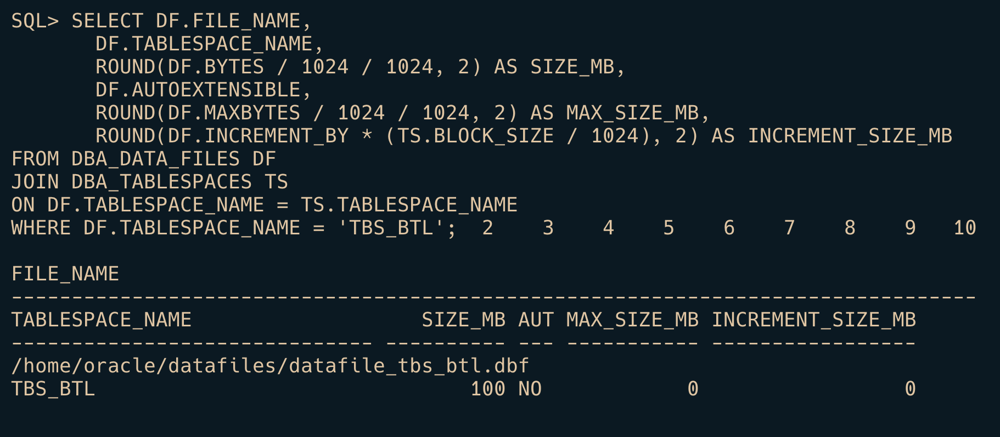

# Contact:
- **Mail**: *lytranvinh.work@gmail.com*
- **Github**: *https://github.com/Youknow2509*
  
# Khởi tạo

- Tạo `tablespace`:
```sql
    -- TABLESPACE chính
    CREATE TABLESPACE TBS_BTL
    DATAFILE '/home/oracle/datafiles/datafile_tbs_btl.dbf' SIZE 100M;
    -- TABLESPACE 2
    CREATE TABLESPACE TBS_BTL_2
    DATAFILE '/home/oracle/datafiles/datafile_tbs_btl_2.dbf' SIZE 50M;
    -- TABLESPCE test drop
    CREATE TABLESPACE TBS_BTL_DROP
    DATAFILE '/home/oracle/datafiles/datafile_tbs_btl_drop.dbf' SIZE 1M;
```


- Tạo `người dùng`:
```sql
    -- Người dùng admin
    CREATE USER vinh IDENTIFIED BY 123
    DEFAULT TABLESPACE TBS_BTL
    TEMPORARY TABLESPACE temp
    QUOTA 100M ON TBS_BTL;

    CREATE USER qlsv IDENTIFIED BY 123
    DEFAULT TABLESPACE TBS_BTL
    TEMPORARY TABLESPACE temp
    QUOTA 80M ON TBS_BTL;

    -- Người dùng sinh viên
    CREATE USER sv IDENTIFIED BY 123
    DEFAULT TABLESPACE TBS_BTL
    TEMPORARY TABLESPACE temp
    QUOTA 10M ON TBS_BTL;

    -- Người dùng giáo viên
    CREATE USER gv IDENTIFIED BY 123
    DEFAULT TABLESPACE TBS_BTL
    TEMPORARY TABLESPACE temp
    QUOTA 1M ON TBS_BTL;

    -- Người dùng test xoá
    CREATE USER t_drop IDENTIFIED BY 123
    DEFAULT TABLESPACE TBS_BTL
    TEMPORARY TABLESPACE temp
    QUOTA 1M ON TBS_BTL;

    -- Người dùng test thay đổi thông tin
    CREATE USER t_alter IDENTIFIED BY 123
    DEFAULT TABLESPACE TBS_BTL
    TEMPORARY TABLESPACE temp
    QUOTA 1M ON TBS_BTL;

    -- Người dùng import data
    CREATE USER v_imp IDENTIFIED BY 123
    DEFAULT TABLESPACE TBS_BTL
    TEMPORARY TABLESPACE temp
    QUOTA 20M ON TBS_BTL;

    -- Người dùng bảo trì hệ thông
    CREATE USER v_restricted IDENTIFIED BY 123
    DEFAULT TABLESPACE TBS_BTL
    TEMPORARY TABLESPACE temp
    QUOTA 2M ON TBS_BTL;
```


- Xem danh sách user trong btl
```sql
    select USERNAME, ACCOUNT_STATUS from dba_users where DEFAULT_TABLESPACE = 'TBS_BTL';
```


- Tạo `role`
```sql
    -- Tạo role admin
    CREATE ROLE admin;
    -- Cấp quyền tạo bảng
    GRANT CREATE TABLE TO admin with admin option;
    -- Cấp quyền Resource
    GRANT RESOURCE to admin with admin option;
    -- Cấp quyền đăng nhập cho role admin
    GRANT CREATE SESSION TO admin with admin option;
    -- Cấp quyền tạo role
    GRANT CREATE ROLE TO admin with admin option;
    -- Cấp quyền tài khoản bảo trì hệ thống
    GRANT RESTRICTED SESSION TO admin WITH ADMIN OPTION;

    -- Tạo role giáo viên
    CREATE ROLE giao_vien;
    -- Xem điểm sinh viên
    GRANT SELECT ON Diem TO giao_vien;  
    -- Sửa điểm sinh viên
    GRANT UPDATE ON Diem TO giao_vien;  
    -- Xem thời gian lớp học phần
    GRANT SELECT ON ThoiGian_LopHocPhan TO giao_vien;  
    -- Xem thời gian
    GRANT SELECT ON ThoiGian TO giao_vien;  
    -- Xem thông tin sinh viên
    GRANT SELECT ON SinhVien TO giao_vien; 

    -- Tạo role sinh viên
    CREATE ROLE sinh_vien;
    -- Xem điểm sinh viên
    GRANT SELECT ON Diem TO sinh_vien;  
    -- Cấp quyền xem sinh viên
    GRANT SELECT ON SinhVien to sinh_vien;

    -- Tạo role có quyền RESTRICTED SESSION
    CREATE ROLE restricted_role;
    -- Cấp quyền RESTRICTED SESSION cho role restricted_role
    GRANT RESTRICTED SESSION TO restricted_role WITH ADMIN OPTION;
    -- Cấp quyền CREATE SESSION cho role restricted_role để người dùng có thể đăng nhập
    GRANT CREATE SESSION TO restricted_role WITH ADMIN OPTION;
```


- Kiểm tra quyền 
```sql
    -- Kiểm tra quyền đã tạo từ admin
    select GRANTED_ROLE from DBA_ROLE_PRIVS where GRANTEE = 'QLSV';

    -- Xem các quyền đang hoạt động của một người dùng
    select * from SESSION_ROLES;

    -- Xem quyền đôi tượng của một role
    select ROLE, TABLE_NAME, PRIVILEGE from ROLE_TAB_PRIVS;

    -- Xem các quyền hệ thông của role
    select ROLE , PRIVILEGE from ROLE_SYS_PRIVS;
```


- `Cấp quyền` cho người dùng
```sql
    grant admin to vinh;
    grant admin to qlsv;

    grant giao_vien to gv;

    grant sinh_vien to sv;

    grant restricted_role to v_restricted;

    -- Tạo thư mục trong hệ điều hành
    -- CREATE OR REPLACE DIRECTORY dpump_dir AS '/home/oracle/schemas';
    CREATE DIRECTORY dpump_dir AS '/home/oracle/schemas';
    GRANT READ, WRITE ON DIRECTORY dpump_dir TO vinh;
    GRANT READ, WRITE ON DIRECTORY dpump_dir TO v_imp;
```

# Import, Export schema - Chi tiết xem trong [readme](/README.md)
- `Export` schema từ user
```bash
    -- đăng nhập dba cấp quyền đọc sửa file cho người dùng
    CREATE DIRECTORY dpump_dir AS '/home/oracle/schemas';
    GRANT READ, WRITE ON DIRECTORY dpump_dir TO 'QLSV';

    -- đăng xuất người dùng xử dụng lệnh
    expdp qlsv/123@orclcdb1 DIRECTORY=dpump_dir DUMPFILE=QLSV_schema.dmp LOGFILE=QLSV_schema_export.log SCHEMAS=QLSV;
```

- `Import` schema vào người dùng
```bash
    -- chú ý cấp quyền xử dụng thư mục cho người dùng
    impdp v_imp/123@orclcdb1 DIRECTORY=dpump_dir DUMPFILE=v_imp_schema.dmp LOGFILE=v_imp_schema_import.log SCHEMAS=QLSV REMAP_SCHEMAS=QLSV:V_IMP
```

# Instance
- Tắt Instance với các chế độ khác nhau 
  - Chú ý phải đăng nhập tải khoản dba.
    - NORMAL: Đóng cơ sở dữ liệu sau khi tất cả các user đã logout.
    - IMMEDIATE: Tắt ngay lập tức, các giao dịch đang chạy bị hủy.
    - ABORT: Tắt ngay lập tức, không chờ xử lý.
```sql
    SHUTDOWN NORMAL;
    SHUTDOWN IMMEDIATE;
    SHUTDOWN ABORT;
```

- Khởi động Oracle Instance để sẵn sàng kết nối với cơ sở dữ liệu.
    - NOMOUNT: Chỉ khởi động bộ nhớ và các tiến trình nền, chưa gắn cơ sở dữ liệu.
    - MOUNT: Gắn cơ sở dữ liệu vào instance (truy cập control file nhưng chưa mở datafile).
    - OPEN: Mở toàn bộ cơ sở dữ liệu cho phép người dùng truy cập.
```sql
    STARTUP NOMOUNT;
    STARTUP MOUNT;
    STARTUP OPEN;
```

- Chế độ bảo trì - những người có đặc quyền mới đang nhập vào được `qlsv, vinh, v_restricted`
```sql
    -- Bật chế độ RESTRICTED
    ALTER SYSTEM ENABLE RESTRICTED SESSION;
    -- Tắt chế độ RESTRICTED
    ALTER SYSTEM DISABLE RESTRICTED SESSION;
```

- Chế độ chỉ đọc - Cơ sở dữ liệu chỉ cho phép đọc, không được phép chỉnh sửa.
```sql
    -- Check trạng thái
    SELECT name, open_mode FROM v$pdbs;
    -- open_mode: READ WRITE, MOUNTED, READ ONLY

    -- Đóng pdb
    ALTER PLUGGABLE DATABASE ORCLCDB1 CLOSE;

    -- Bật trạng thái read only
    ALTER PLUGGABLE DATABASE ORCLCDB1 OPEN READ ONLY;
```


# Quản lý Tablespace
## Xem Thông Tin Chung, Trạng Thái
- Xem thông tin chung table space
```sql
    SELECT DATA_FILES.TABLESPACE_NAME,
           ROUND(SUM(DATA_FILES.BYTES) / 1024 / 1024, 2) AS TOTAL_SIZE_MB,
           ROUND(SUM(DATA_FILES.BYTES - NVL(FREE_SPACE.BYTES, 0)) / 1024 / 1024, 2) AS USED_SIZE_MB,
           ROUND(SUM(NVL(FREE_SPACE.BYTES, 0)) / 1024 / 1024, 2) AS FREE_SIZE_MB,
           ROUND(SUM(NVL(FREE_SPACE.BYTES, 0)) * 100 / SUM(DATA_FILES.BYTES), 2) AS FREE_PERCENT
    FROM DBA_DATA_FILES DATA_FILES
    LEFT JOIN DBA_FREE_SPACE FREE_SPACE
    ON DATA_FILES.FILE_ID = FREE_SPACE.FILE_ID
    GROUP BY DATA_FILES.TABLESPACE_NAME;
```


- Xem dung lượng table space
```sql
    SELECT DATA_FILES.TABLESPACE_NAME,
           ROUND(SUM(DATA_FILES.BYTES) / 1024 / 1024, 2) AS TOTAL_SIZE_MB,
           ROUND(SUM(DATA_FILES.BYTES - NVL(FREE_SPACE.BYTES, 0)) / 1024 / 1024, 2) AS USED_SIZE_MB,
           ROUND(SUM(NVL(FREE_SPACE.BYTES, 0)) / 1024 / 1024, 2) AS FREE_SIZE_MB,
           ROUND(SUM(NVL(FREE_SPACE.BYTES, 0)) * 100 / SUM(DATA_FILES.BYTES), 2) AS FREE_PERCENT
    FROM DBA_DATA_FILES DATA_FILES
    LEFT JOIN DBA_FREE_SPACE FREE_SPACE
    ON DATA_FILES.FILE_ID = FREE_SPACE.FILE_ID
    GROUP BY DATA_FILES.TABLESPACE_NAME;
```


- Xem datafile của một tablespace
```sql
    SELECT DF.FILE_NAME,
           DF.TABLESPACE_NAME,
           ROUND(DF.BYTES / 1024 / 1024, 2) AS SIZE_MB,
           DF.AUTOEXTENSIBLE,
           ROUND(DF.MAXBYTES / 1024 / 1024, 2) AS MAX_SIZE_MB,
           ROUND(DF.INCREMENT_BY * (TS.BLOCK_SIZE / 1024), 2) AS INCREMENT_SIZE_MB
    FROM DBA_DATA_FILES DF
    JOIN DBA_TABLESPACES TS
    ON DF.TABLESPACE_NAME = TS.TABLESPACE_NAME
    WHERE DF.TABLESPACE_NAME = 'TBS_BTL';
```


- Kiểm tra Tablespace tạm thời (Temporary Tablespace)
```sql
    SELECT TABLESPACE_NAME, FILE_NAME,
       ROUND(BYTES/1024/1024, 2) AS SIZE_MB,
       AUTOEXTENSIBLE, MAXBYTES/1024/1024 AS MAX_SIZE_MB
    FROM DBA_TEMP_FILES;
```


- Kiểm tra Undo Tablespace
```sql
    SELECT TABLESPACE_NAME, FILE_NAME,
         ROUND(BYTES/1024/1024, 2) AS SIZE_MB,
         AUTOEXTENSIBLE, MAXBYTES/1024/1024 AS MAX_SIZE_MB
    FROM DBA_DATA_FILES
    WHERE TABLESPACE_NAME = (SELECT VALUE FROM V$PARAMETER WHERE NAME = 'undo_tablespace');
```


-  Kiểm tra trạng thái ONLINE/OFFLINE của Tablespace
```sql
   SELECT TABLESPACE_NAME, STATUS
   FROM DBA_TABLESPACES;
```


- Kiểm tra phần trăm dung lượng còn trống
```sql
    SELECT 
        TABLESPACE_NAME,
        ROUND((TOTAL_MB - USED_MB), 2) AS FREE_MB,
        ROUND((FREE_MB / TOTAL_MB) * 100, 2) AS FREE_PERCENT
    FROM (
      SELECT 
          DATA_FILES.TABLESPACE_NAME,
          SUM(DATA_FILES.BYTES) / 1024 / 1024 AS TOTAL_MB,
          SUM(DATA_FILES.BYTES - NVL(FREE_SPACE.BYTES, 0)) / 1024 / 1024 AS USED_MB,
          SUM(NVL(FREE_SPACE.BYTES, 0)) / 1024 / 1024 AS FREE_MB
      FROM DBA_DATA_FILES DATA_FILES
      LEFT JOIN DBA_FREE_SPACE FREE_SPACE
      ON DATA_FILES.FILE_ID = FREE_SPACE.FILE_ID
      GROUP BY DATA_FILES.TABLESPACE_NAME
    );
```


- Kiểm tra Tablespace đang bị đầy
```sql
    SELECT TABLESPACE_NAME,
       ROUND((TOTAL_MB - USED_MB), 2) AS FREE_MB,
       CASE
           WHEN ROUND((FREE_MB / TOTAL_MB) * 100, 2) < 10 THEN 'NEAR FULL'
           ELSE 'OK'
       END AS STATUS
FROM (
    SELECT DATA_FILES.TABLESPACE_NAME,
           SUM(DATA_FILES.BYTES) / 1024 / 1024 AS TOTAL_MB,
           SUM(DATA_FILES.BYTES - NVL(FREE_SPACE.BYTES, 0)) / 1024 / 1024 AS USED_MB,
           SUM(NVL(FREE_SPACE.BYTES, 0)) / 1024 / 1024AS FREE_MB
    FROM DBA_DATA_FILES DATA_FILES
    LEFT JOIN DBA_FREE_SPACE FREE_SPACE
    ON DATA_FILES.FILE_ID = FREE_SPACE.FILE_ID
    GROUP BY DATA_FILES.TABLESPACE_NAME
);
```


## Quản Lí Tablespace:
- Thêm Datafile vào Tablespace:
```sql
    ALTER TABLESPACE TBS_BTL_2 ADD DATAFILE '/home/oracle/datafiles/test_add_df.dbf' SIZE 10M AUTOEXTEND ON NEXT 10M MAXSIZE 50m;
```


- Kiểm tra dung lượng Datafile:
```sql
    SELECT file_name,
       bytes / (1024 * 1024) AS size_mb,
       maxbytes / (1024 * 1024) AS max_size_mb,
       autoextensible
    FROM dba_data_files where TABLESPACE_NAME = 'TBS_BTL_2';
```

- Thay đổi kích thước Datafile:
```sql
    ALTER DATABASE DATAFILE '/home/oracle/datafiles/test_add_df.dbf' RESIZE 20M;
```


- Bật hoặc tắt tính năng autoextend cho một datafile:
```sql
    ALTER DATABASE DATAFILE '/home/oracle/datafiles/test_add_df.dbf'
    AUTOEXTEND ON NEXT 10M MAXSIZE UNLIMITED;
```

- Xóa Tablespace
```sql
    DROP TABLESPACE TBS_BTL_DROP INCLUDING CONTENTS AND DATAFILES;
```

- Đưa Tablespace về trạng thái OFFLINE/ONLINE
```sql
    -- OFFLINE
    ALTER TABLESPACE TBS_BTL_2 OFFLINE;
    -- ONLINE
    ALTER TABLESPACE TBS_BTL_2 ONLINE;
```

## Xem Thông Tin Datafile trong tablespace:
- Truy vấn danh sách các Datafile của các Tablespace vĩnh viễn:
```sql
    SELECT DDF.FILE_ID,
       DDF.FILE_NAME,
       DDF.TABLESPACE_NAME,
       ROUND(DDF.BYTES / 1024 / 1024, 2) AS SIZE_MB,
       DDF.AUTOEXTENSIBLE,
       ROUND(DDF.MAXBYTES / 1024 / 1024, 2) AS MAX_SIZE_MB,
       DDF.INCREMENT_BY * (TS.BLOCK_SIZE / 1024) AS INCREMENT_SIZE_MB
FROM DBA_DATA_FILES DDF
JOIN DBA_TABLESPACES TS ON DDF.TABLESPACE_NAME = TS.TABLESPACE_NAME;
```


- Truy vấn thông tin về các Datafile tạm thời (Temporary Tablespace):
```sql
    SELECT TABLESPACE_NAME,
           FILE_NAME,
           ROUND(BYTES/1024/1024, 2) AS SIZE_MB,
           AUTOEXTENSIBLE,
           MAXBYTES/1024/1024 AS MAX_SIZE_MB
    FROM DBA_TEMP_FILES;
```


- Truy vấn trạng thái của các Datafile (ONLINE/OFFLINE):
```sql
    SELECT DF.FILE# AS FILE_ID,
           DF.NAME AS FILE_NAME,
           TS.NAME AS TABLESPACE_NAME,
           DF.STATUS
    FROM V$DATAFILE DF
    JOIN V$TABLESPACE TS ON DF.TS# = TS.TS#;
```


- Truy vấn dung lượng đã sử dụng và còn trống trong mỗi Datafile:
```sql
    SELECT TABLESPACE_NAME,
           FILE_NAME,
           ROUND(BYTES/1024/1024, 2) AS TOTAL_SIZE_MB,
           ROUND(FREE_SPACE/1024/1024, 2) AS FREE_SIZE_MB,
           ROUND((BYTES - FREE_SPACE)/BYTES * 100, 2) AS USED_PERCENT
    FROM (
        SELECT DF.TABLESPACE_NAME, DF.FILE_NAME, DF.BYTES,
               (DF.BYTES - NVL(FS.BYTES, 0)) AS FREE_SPACE
        FROM DBA_DATA_FILES DF
        LEFT JOIN (
            SELECT FILE_ID, SUM(BYTES) AS BYTES
            FROM DBA_FREE_SPACE
            GROUP BY FILE_ID
        ) FS
        ON DF.FILE_ID = FS.FILE_ID
    );
```


- Xem danh sách các Datafile có tính năng Autoextend:
```sql
    SELECT DF.FILE_NAME,
           DF.TABLESPACE_NAME,
           DF.AUTOEXTENSIBLE,
           ROUND(DF.INCREMENT_BY * TS.BLOCK_SIZE / 1024 / 1024, 2) AS INCREMENT_SIZE_MB,
           ROUND(DF.MAXBYTES / 1024 / 1024, 2) AS MAX_SIZE_MB
    FROM DBA_DATA_FILES DF
    JOIN DBA_TABLESPACES TS ON DF.TABLESPACE_NAME = TS.TABLESPACE_NAME
    WHERE DF.AUTOEXTENSIBLE = 'YES';
```


# Truy Vấn Thông Tin Cấu Trúc Lưu Trữ (segment, extent)
- `Segment`:
    - Là một đối tượng `logic` trong cơ sở dữ liệu Oracle, lưu trữ dữ liệu thực tế (ví dụ: bảng, chỉ mục, undo, tạm thời).
    - Mỗi segment bao gồm nhiều Extent.
- `Extent`:
    - Là một tập hợp các khối (blocks) liên tục trong một datafile.
    - Extent được phân bổ khi segment cần thêm không gian lưu trữ.

## Truy Vấn Thông Tin Segment
- Danh Sách Các Segment Trong Tablespace
```sql
    SELECT SEGMENT_NAME, SEGMENT_TYPE, TABLESPACE_NAME, BYTES/1024/1024 AS SIZE_MB, BLOCKS
    FROM DBA_SEGMENTS
    WHERE TABLESPACE_NAME = 'TBS_BTL';
```


- Hiện thị thông tin Segment sở bởi user
```sql
    SELECT segment_name, tablespace_name, blocks FROM dba_segments WHERE owner = 'QLSV';
```


## Truy Vấn Thông Tin Extent
- Tính tổng dung lượng tất cả các extent trong một tablespace cụ thể.
```sql
    SELECT TABLESPACE_NAME, SUM(BYTES)/1024/1024 AS TOTAL_SIZE_MB
    FROM DBA_EXTENTS
    WHERE TABLESPACE_NAME = 'TBS_BTL'
    GROUP BY TABLESPACE_NAME;
```


- Hiển thị thông tin về các block của từng extent trong segment.
```sql
    SELECT SEGMENT_NAME, EXTENT_ID, FILE_ID, BLOCK_ID, BLOCKS
    FROM DBA_EXTENTS
    WHERE SEGMENT_NAME = 'SINHVIEN';
```


- Tổng số block được sử dụng trong một tablespace cụ thể.
```sql
    SELECT TABLESPACE_NAME, SUM(BLOCKS) AS TOTAL_BLOCKS
    FROM DBA_EXTENTS
    WHERE TABLESPACE_NAME = 'TBS_BTL'
    GROUP BY TABLESPACE_NAME;
```


# Người dùng
- Khóa và Mở Khóa Tài Khoản
```sql
    -- Khoá tài khoản
    ALTER USER vinh ACCOUNT LOCK;
    -- Mở khoá tài khoản
    ALTER USER vinh ACCOUNT UNLOCK;
```

## Cấu Hình Thời Gian Sử Dụng Mật Khẩu
- Kiểm Tra Hồ Sơ Cấu Hình Mật Khẩu (Profile)
```sql
    SELECT * FROM DBA_PROFILES WHERE RESOURCE_NAME LIKE 'PASSWORD%';
    select PROFILE from DBA_PROFILES;
```
- Các tham số thường dùng trong profile
    - `PASSWORD_LIFE_TIME`: Thời gian tối đa mật khẩu có hiệu lực.
    ```sql
        ALTER PROFILE default LIMIT PASSWORD_LIFE_TIME 180;
        -- Điều này có nghĩa là mật khẩu phải được thay đổi sau 180 ngày.
    ```
    - `PASSWORD_REUSE_TIME`: Thời gian yêu cầu trước khi một mật khẩu có thể được tái sử dụng.
    ```sql
        ALTER PROFILE default LIMIT PASSWORD_REUSE_TIME 365;
        -- Điều này có nghĩa là người dùng không thể tái sử dụng mật khẩu cũ trong vòng 365 ngày.
    ```
    - `PASSWORD_GRACE_TIME`: Số ngày cho phép sau khi mật khẩu hết hạn để thay đổi mật khẩu.
    ```sql
        ALTER PROFILE default LIMIT PASSWORD_GRACE_TIME 7;
    ```
    - `FAILED_LOGIN_ATTEMPTS`:Số lần đăng nhập sai tối đa cho phép trước khi tài khoản bị khóa.
    ```sql
        ALTER PROFILE default LIMIT FAILED_LOGIN_ATTEMPTS 5;
    ```
    - `SESSIONS_PER_USER`: Số phiên làm việc đồng thời tối đa mà một người dùng có thể mở.
    ```sql 
    ALTER PROFILE default LIMIT SESSIONS_PER_USER 3;
    ```
    - `IDLE_TIME`: Thời gian nhàn rỗi tối đa (tính bằng phút) trước khi một phiên làm việc bị tự động kết thúc.
    ```sql
        ALTER PROFILE default LIMIT IDLE_TIME 30;
    ```
    - `CONNECT_TIME`: Thời gian tối đa (tính bằng phút) mà người dùng có thể duy trì kết nối với cơ sở dữ liệu.
    ```sql
        ALTER PROFILE default LIMIT CONNECT_TIME 60;
    ```
    - `CPU_PER_SESSION`: Số lượng thời gian CPU tối đa (tính bằng giây) mà người dùng có thể sử dụng trong một phiên làm việc.
    ```sql
        ALTER PROFILE default LIMIT CPU_PER_SESSION 1000;
    ```
    - `COMPOSITE_LIMIT`:Xác định mức tiêu thụ tài nguyên tổng hợp của phiên làm việc của người dùng, bao gồm CPU, bộ nhớ và các tài nguyên hệ thống khác. Thường được sử dụng để giới hạn việc sử dụng tài nguyên của hệ thống.
    ```sql
        ALTER PROFILE default LIMIT COMPOSITE_LIMIT 5000000;
    ```
- Tạo profile
```sql
    CREATE PROFILE v_profile_1 LIMIT
    PASSWORD_LIFE_TIME 30           -- Thời gian mật khẩu có hiệu lực là 30 ngày.
    PASSWORD_REUSE_TIME 60          -- Thời gian phải đợi ít nhất 60 ngày trước khi mật khẩu có thể được tái sử dụng.
    PASSWORD_REUSE_MAX 5         -- Số lần tối đa mật khẩu có thể được tái sử dụng là 5 lần.
    FAILED_LOGIN_ATTEMPTS 2;
```

## Config
- Sửa
```sql
ALTER PROFILE v_profile_1 LIMIT
    FAILED_LOGIN_ATTEMPTS 3             -- Sửa đổi số lần đăng nhập sai tối đa
    CONNECT_TIME 120                    -- Sửa đổi thời gian kết nối tối đa
    PASSWORD_LIFE_TIME 90;              -- Thay đổi thời gian tối đa của mật khẩu
```

- Xoá
```sql
  DROP PROFILE v_profile_1;
```

- Gán và thay đổi
```sql
    ALTER USER vinh PROFILE v_profile_1;
```
